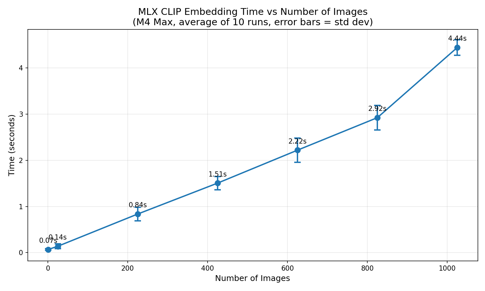

# Local Image Search

Local image search using MLX CLIP embeddings and Daft for batch processing.

## Features

- Generate CLIP embeddings for images using Apple's MLX framework
- Batch process images efficiently with Daft
- Search images using natural language queries

## Requirements

- macOS with Apple Silicon (M1/M2/M3/M4)
- Python 3.11+

## Setup

```bash
# Install dependencies
uv sync

# Download and convert CLIP model (first time only)
cd clip && uv run python convert.py && cd ..
```

## Usage

### Simple search (2 sample images)
```bash
uv run python simple_image_search.py
```

### Daft-based search (batch processing)
```bash
uv run python daft_image_search.py
```

## Project Structure

```
local-image-search/
├── clip/                    # MLX CLIP implementation (from ml-explore/mlx-examples)
│   ├── model.py             # CLIP model architecture
│   ├── clip.py              # Model loading and inference
│   ├── convert.py           # HuggingFace to MLX converter
│   ├── image_processor.py   # Image preprocessing
│   ├── tokenizer.py         # Text tokenization
│   ├── mlx_model/           # Converted model weights (generated)
│   └── LICENSE              # MIT License (Apple Inc.)
├── data/
│   └── pokemon/             # Pokemon artwork (1025 images)
├── simple_image_search.py   # Basic in-memory search demo
├── daft_image_search.py     # Daft-based batch processing
├── benchmark.py             # Benchmark script
├── plot_benchmark.py        # Generate benchmark plot
├── benchmark_results.csv    # Raw benchmark data (10 runs)
├── benchmark_plot.png       # Benchmark visualization
├── CLAUDE.md                # Project notes and next steps
├── pyproject.toml           # Project dependencies
└── uv.lock                  # Dependency lockfile
```

## Benchmarks



Run benchmarks yourself:
```bash
uv run python benchmark.py      # Run one iteration, appends to CSV
uv run python benchmark.py 100  # Benchmark with specific number of images
uv run python plot_benchmark.py # Generate plot from CSV
```

## Data Attribution

### Pokemon Artwork
- **Source**: [PokeAPI/sprites](https://github.com/PokeAPI/sprites)
- **License**: Repository is CC0 1.0 Universal
- **Copyright**: All Pokemon images are Copyright The Pokemon Company

### CLIP Implementation
- **Source**: [ml-explore/mlx-examples](https://github.com/ml-explore/mlx-examples)
- **License**: MIT License (Apple Inc.)
